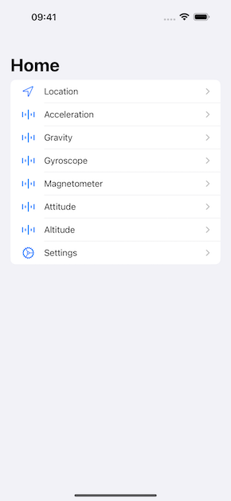

# Sensor-App

Sensor-app provides access to all Sensors on iPhone, iPad and Apple Watch.

Get it from App Store [here](https://apps.apple.com/us/app/sensor-app/id1466399692?l=de&ls=1 "Sensor-App")

# Contribution Guidelines

Thank you for your interest in contributing to the Sensor-App project! This repository is dedicated to improving the app by tracking feedback, feature suggestions, bug reports, and contributions to the source code. Sensor-App is an open-source project, and the source code is publicly available.

To ensure a smooth collaboration, please read and follow these guidelines:

## How to Contribute

### 1. Reporting Bugs
If you encounter a bug, please [open an issue](https://github.com/Volker88/Sensor-App/issues) and include the following details:
- A clear and concise description of the problem.
- Steps to reproduce the issue.
- Expected vs. actual behavior.
- Screenshots or error logs, if applicable.
- Environment details (e.g., app version, device, OS version).

### 2. Suggesting Features or Enhancements
Have a great idea? We'd love to hear it! To propose a new feature:
- Check if your idea is already being discussed or tracked in [existing issues](https://github.com/Volker88/Sensor-App/issues).
- If not, create a new issue with the following information:
  - A detailed description of the feature.
  - The problem it solves or how it improves the app.
  - Any relevant mockups, examples, or use cases.

### 3. Contributing Code
We welcome pull requests for bug fixes, new features, and other improvements. Here's how you can contribute code:

1. **Fork the repository**: Clone it to your local machine.
2. **Create a new branch**: Use a descriptive branch name, such as `feature/feature-name` or `bugfix/issue-number`.
3. **Make changes**: Write clean, well-documented code that adheres to the project's coding standards.
4. **Test your changes**: Ensure your contribution works as expected.
5. **Submit a pull request**: Open a pull request to the `main` branch, describing:
   - What changes have been made.
   - Which issue it addresses (if applicable).
   - Steps to test the changes.

> **Note:** All code contributions must pass existing tests and adhere to the project's style guidelines.

### 4. Improving Documentation
Good documentation is critical for the success of any project. If you spot typos, unclear instructions, or missing details in the README or other content, feel free to:
- Submit an issue highlighting the problem.
- Open a pull request with your suggested improvements.

### 5. Participating in Discussions
We welcome constructive feedback and ideas to improve the project. Join ongoing discussions by commenting on issues or participating in [discussions](https://github.com/Volker88/Sensor-App/discussions). Please remain respectful and open-minded when engaging with others.

## Coding Standards
To maintain consistency, please follow these practices:
- Use [SwiftLint](https://github.com/realm/SwiftLint) and [swift-format](https://github.com/apple/swift-format) for code formatting.
- Write descriptive commit messages (e.g., `Fix crash when loading large files`).
- Include comments for complex logic or non-obvious code.
- Add appropriate tests for new features or bug fixes.

## Code of Conduct
This project follows a [Code of Conduct](CODE_OF_CONDUCT.md) to ensure a welcoming and inclusive environment for everyone. Please read it before contributing.

## Getting Help
If you have questions or need help, feel free to:
- Open a [discussion](https://github.com/Volker88/Sensor-App/discussions).
- Comment on an issue or pull request.

We appreciate your time and effort in improving Sensor-App. Thank you for contributing!

